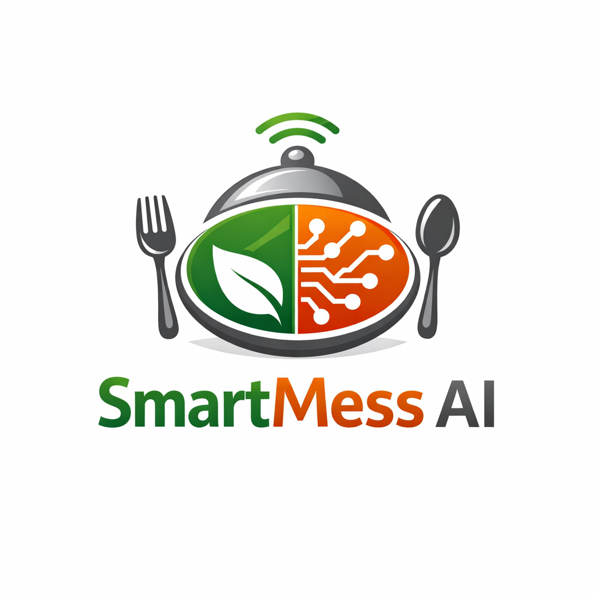

\# 🍽️ SmartMess AI — Intelligent Food Demand Prediction System

  

# 🍽️ SmartMess AI — Intelligent Food Demand Prediction System

Predicts how many people will actually eat — not just who said they will.

\## 🚀 Problem

PG kitchens waste food daily due to inaccurate attendance estimation.

\## 💡 Solution

SmartMess AI uses behavioral modeling and machine learning to predict actual meal demand.

\## 🧠 Key Features

\- Reliability Scoring (user honesty tracking)

\- Walk-in Prediction (silent users modeling)

\- Feedback Learning Loop (continuous improvement)

\- Cold Start Handling (initial estimation strategy)

\## ⚙️ Tech Stack

\- Python

\- Streamlit

\- SQLite

\- Scikit-learn

\- Bcrypt

\## 📊 Architecture

\- Multi-tenant PG system using unique PG codes

\- 7-table relational database

\- Real-time prediction engine

\## 💰 Business Model

\- ₹199/month per PG

\- Saves ₹300+/day in food waste

\## 🔥 What Makes It Unique

Unlike simple voting systems, SmartMess AI learns human behavior over time and improves predictions continuously.

\---

\## 📌 Future Improvements

\- Mobile app version

\- Advanced ML models

\- Dashboard analytics

\---

\## 👨‍💻 Author

Sakthivel S M

